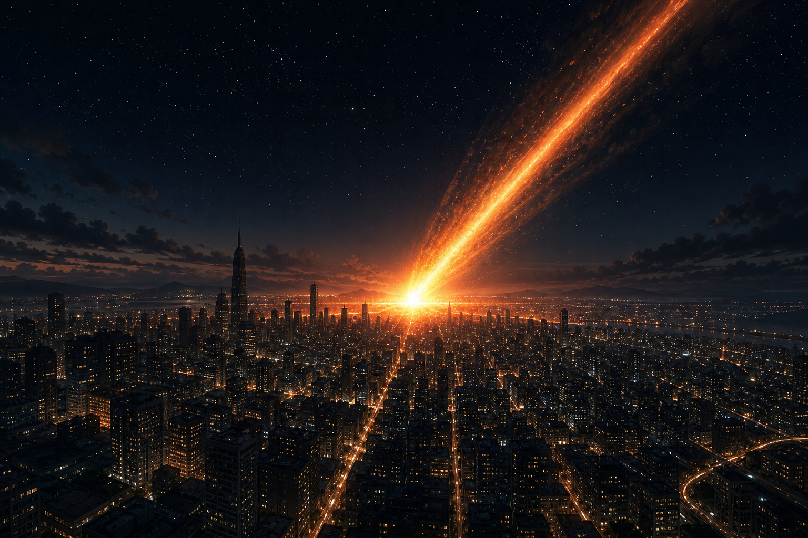

# ☄ Meteor Impact (Revival)



> A browser-based 3D destruction game built with **Three.js** and **Vite**.  
> Rain meteors on a procedural city, but the skyline fights back.

**Play:** [meteor-city-revival.vercel.app](https://meteor-city-revival.vercel.app)

---

## Intro

**Meteor Impact (Revival)** drops you above a procedurally generated city sleeping under moonlight. Your mission is simple to describe and brutal to execute: **destroy every building at once**.

Each impact sends towers tumbling, lights flickering out, and shockwaves rippling across the streets. The catch? **The city regenerates.** Knocked-down buildings rebuild after a delay, scaling back up from the ground. You win only when **100% destruction** is achieved in a single moment before the skyline heals itself.

There are no powerups. Every meteor is the same size. Winning is a timing puzzle: cover the whole map, spam fast, and sync a final wave before regen catches up. Orbit the carnage, switch to cinematic camera mode, and chase your best time and launch count.

---

## How To Run

### Prerequisites

- [Node.js](https://nodejs.org/) **18+** (LTS recommended)
- A modern browser with **WebGL** support (Chrome, Firefox, Edge, Safari)

### Development

```bash
# Install dependencies
npm install

# Start the dev server (default: http://localhost:5173)
npm run dev
```

Open the URL shown in your terminal, click **Start** on the intro screen, and begin launching meteors.

The dev server includes local API routes for game sessions (`/api/start`, `/api/verify`). Wins are verified server-side in dev without extra setup.

### Production Build

```bash
# Build optimized static assets to dist/
npm run build

# Preview the production build locally
npm run preview
```

Deploy to [Vercel](https://vercel.com/) (recommended) or any static host. API routes live in `api/` and deploy as serverless functions alongside the Vite build.

### Environment Variables (Production)

Set this on Vercel (or your host) for signed game sessions and win verification:

| Variable | Purpose |
|---|---|
| `GAME_SESSION_SECRET` | HMAC secret for session tokens. Use a long random string. Without it, a dev fallback is used (not safe for production). |

---

## Features

### Gameplay

| | |
|---|---|
| **Objective** | Achieve **100% building destruction** simultaneously |
| **Challenge** | Destroyed buildings **regenerate** after **5–9 seconds**, then regrow in **~2.2 seconds** |
| **Blast radius** | **135** units per meteor (fixed) |
| **Meteors in flight** | Up to **14** at once |
| **City size** | ~**650** buildings per seeded layout (trees are decorative only) |
| **HUD** | Live stats for clicks, elapsed time, and destruction percentage |
| **Win screen** | Shown only after **server-verified** replay of your impact log |

High destruction (85–95%) in the first 15 seconds is normal when spamming meteors across the map. **Clearing** the city (100% at once) is much harder and requires covering the full map before early hits start regenerating.

### Win Verification

Wins are not trusted from the browser alone. The flow:

1. **Start** — server issues a signed token and city seed.
2. **Play** — the client logs each impact `{ time, x, z }` against that seed.
3. **100% reached** — the client sends the log to the server, which replays the simulation and confirms a legitimate wipe.

DOM or console tricks cannot grant a win without passing server replay.

### World & Visuals

- **Procedural city**: seeded grid layout with varied building heights, parks, and lit windows
- **Night atmosphere**: exponential fog, starfield, ACES filmic tone mapping
- **Impact effects**: particle explosions, smoke plumes, dual shockwaves, size-scaled impact flares, flying debris
- **Post-processing**: Unreal Bloom and FXAA for a cinematic glow
- **Camera shake**: scales with impact intensity
- **Mobile optimized**: stacked touch controls, safe-area padding, reduced bloom resolution, adaptive rendering

### Controls

#### Mouse & Keyboard (Desktop)

| Action | Input |
|---|---|
| Orbit camera | Click & drag |
| Zoom | Scroll wheel |
| Launch meteor | **Space** or **Launch Meteor** button |
| Reset game | **R** or **Reset Game** button |
| Cinematic camera | **C** or **Cinematic View** button |

#### Touch (Mobile)

| Action | Input |
|---|---|
| Orbit camera | Drag |
| Zoom | Pinch |
| Launch meteor | Tap **Launch** |

> After ~8 seconds of inactivity, the camera gently auto-orbits the city.

### Audio

Procedural sound effects powered by the **Web Audio API**: meteor whoosh and impact booms. Audio initializes when you press **Start** (browser autoplay policy).

---

## Tech Stack

| Layer | Technology |
|---|---|
| 3D engine | [Three.js](https://threejs.org/) r160 |
| Build tool | [Vite](https://vitejs.dev/) 5 |
| Language | JavaScript (ES modules) |
| Audio | Web Audio API (procedural synthesis) |
| Backend | Vercel serverless (`api/game/*`) |
| Shared sim | `shared/` (seeded RNG, city layout, impact replay) |

---

## Disclaimer

**Meteor Impact (Revival) is a work of fiction created for entertainment purposes only.**

All destruction depicted in this game is **entirely simulated**. No real cities, buildings, or people are harmed. The game does not promote, encourage, or glorify violence against people or property in the real world.

This project is provided **as-is**, without warranty of any kind. Performance, compatibility, and availability may vary by device and browser. Use at your own discretion.

---

<p align="center">
  <strong>Now go become Death, the destroyer of worlds.</strong><br>
  <em>At least, in this city.</em>
</p>
